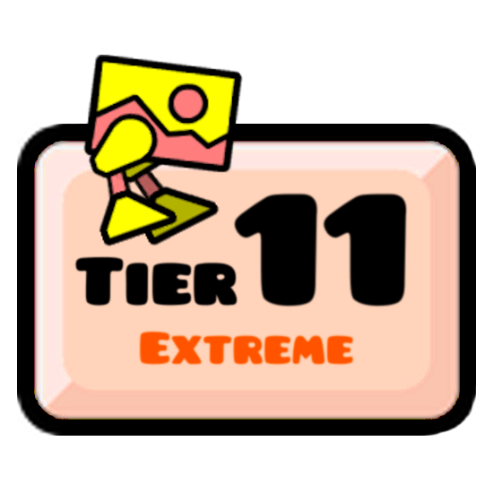
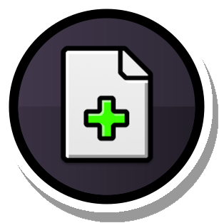

# Ultimate Plat Integration 
### Geode mod that integrates the Platformer Tier List system into level info.

    Download

    ►<a href="https://github.com/Ruslanych/Ultimate-Plat-Integration/releases/tag/stable">HERE</a>◄ 

    You have to download the mod file <i style="font-weight:400;"><u>ruslanych.ultimate-plat-integration.geode</u></i> and <b><u>open</u></b> it using <b><u>Geode&nbsp;Import&nbsp;&nbsp;button</b></u>.
    

 

    Credits:

### Inspirations:
* B1rtek & Diversion - GDDL Integration

### Special thanks to:
* Synactivem, Maddy - Geometry dash 

### Sources:
* [Geode SDK](https://docs.geode-sdk.org/) - development platform
* [Platformer Difficulty Chart](https://docs.google.com/spreadsheets/d/1ApwiAVAcBmfyoPW3wvDzc8JvY4Lfg5tFsPlYg3DNWhc/edit?gid=219181119#gid=219181119) - database